```{r setup, include=FALSE}
knitr::opts_chunk$set(echo = FALSE)
```

```{r, comment='', echo=FALSE, message=FALSE, warning=FALSE}
library(shiny)
library(dplyr)
library(ggplot2)
library(RColorBrewer)
library(leaflet)
```

## Outline

### 1. Two Motivation Examples (4 mins)

### 2. Brief Introduction to R Shiny (1 min)

### 3. Let's bulid our Shiny app! (7-9 mins)
- We will skip some details today.

### 4. More Shiny App Resources and Examples (1 min)

### 5. Summary and Take-Home Messages (2 mins)

### 6. Q & A (4-5 mins)

### 7. Appendix
- We will not cover it today.

<br/>

## Outline

### What we will learn in the following 15-20 minutes:

1. What is R Shiny? 

2. Why using R Shiny? 

3. How to use R Shiny? 

<br/>
<br/>

### Let's go! 

<div class="notes">
This is my *note*.

- It can contain markdown
- like this list
</div>

## [1] Motivation Example - Binning of the histogram (1/5)

Remember "binning of the histogram", the idea we have discussed in the class?

### Is this a good binning?

```{r, comment='', echo=FALSE, fig.height=3, fig.width=4, fig.align='center'}
x <- faithful[,2]
hist(x, breaks = 10, col = 'darkgray', border = 'white')
```

## [1] Motivation Example - Binning of the histogram (2/5)

### Then how about this one?

```{r, comment='', echo=FALSE, fig.height=4.5, fig.width=6, fig.align='center'}
x <- faithful[,2]
hist(x, breaks = 60, col = 'darkgray', border = 'white')
```
  
## [1] Motivation Example - Binning of the histogram (3/5)

### or this one?

```{r, comment='', echo=FALSE, fig.height=4.5, fig.width=6, fig.align='center'}
x <- sample(faithful[,2], 10)
hist(x, breaks = 10, col = 'darkgray', border = 'white')
```

## [1] Motivation Example - Binning of the histogram (4/5)

### Try to explain how to choose an appropriate binning of the histogram.

<br/>


## [1] Motivation Example - Binning of the histogram (5/5)

```{r, comment='', echo=FALSE}
### ui

# Sidebar with a slider input for number of bins
sidebarLayout(
  sidebarPanel(
    sliderInput("bins", "Number of bins",
                min = 1, max = 50, value = 30),
    numericInput("ss", "Sample size",
                 min = 10, max = 272, value = 100, step = 1),
    width = 3
  ),
  
  # Show a plot of the generated distribution
  mainPanel(plotOutput("distPlot_hist"), width = 8)
)

### server

output$distPlot_hist <- renderPlot({
  # generate bins based on input$bins from ui.R
  x    <- sample(faithful[,2], input$ss)
  bins <- seq(min(x), max(x), length.out = input$bins + 1)
  
  # draw the histogram with the specified number of bins
  hist(x, breaks = bins, col = 'darkgray', border = 'white')
})
```

## [1] Motivation Example - t and Z distribution (1/3) {.incremental}

### - What is the association of Student's t distribution and the standard normal distribution?

### - How to demonstrate it?

```{r, comment='', echo=FALSE}
f_tz <- function(df, b=6) {
  x <- seq(-pi*2, 2*pi, by = .05)
  z <- dnorm(x)
  y <- dt(x, df = df)
  plot(x, z, type= "l" , bty = "L", xlim = c(-b, b),
       xlab = "Standard unit", ylab = "Density")
  polygon(c(x, rev(x)), c(y, rev(z)), col = 'aliceblue')
  lines(x, y, col='cadetblue')
  text(-b + 1.6, 0.3, paste0('df = ', df)) 
}
```

## [1] Motivation Example - t and Z distribution (2/3)

```{r, comment='', echo=FALSE, fig.height=4.5*6.5/6, fig.width=6.5, fig.align='center'}
par(mfrow = c(2, 3))
plts <- lapply(c(1, 3, 5, 10, 30, 50), f_tz)
par(mfrow = c(1, 1))
```

## [1] Motivation Example - t and Z distribution (3/3)

```{r, comment='', echo=FALSE, fig.height=6, fig.width=8, fig.align='center'}
sidebarLayout(
        sidebarPanel(
            numericInput("df", "The degree of freedom",
                         min = 1, max = 100, value = 1, step = 1),
            width = 3
        ),
        mainPanel(plotOutput("distPlot_t"))
    )

output$distPlot_t <- renderPlot({f_tz(input$df, b = 4)})
```

## [2] Brief Introduction to R Shiny {.smaller}

- A recent technology created by RStudio (Chang, Cheng, Allaire, Xie & McPherson, 2015)

- A web application framework for R (R Core Team, 2015) that only requires knowledge in the R programming language

- Instructors can build a teaching tool that is interactive, dynamic, user-friendly, visually appealing, and, with similar functionality to Java/Javascript applets with shiny, the only requirement is some familiarity in R.
  - https://shiny.rstudio.com/
  - http://www.statistics.calpoly.edu/shiny

<div class="text-center">
  
</div>

## [3] Let's bulid our Shiny app! {.incremental}

- Shiny app is usually comprised of two components: A user-interface script (`ui.R`) and a server script (`server.R`).
  - ui: Design your web app layout, input format, ...
  - server: 伺服器（伺機服務）Reseponse if user give any input through **ui**.
  
<div class="text-center">
  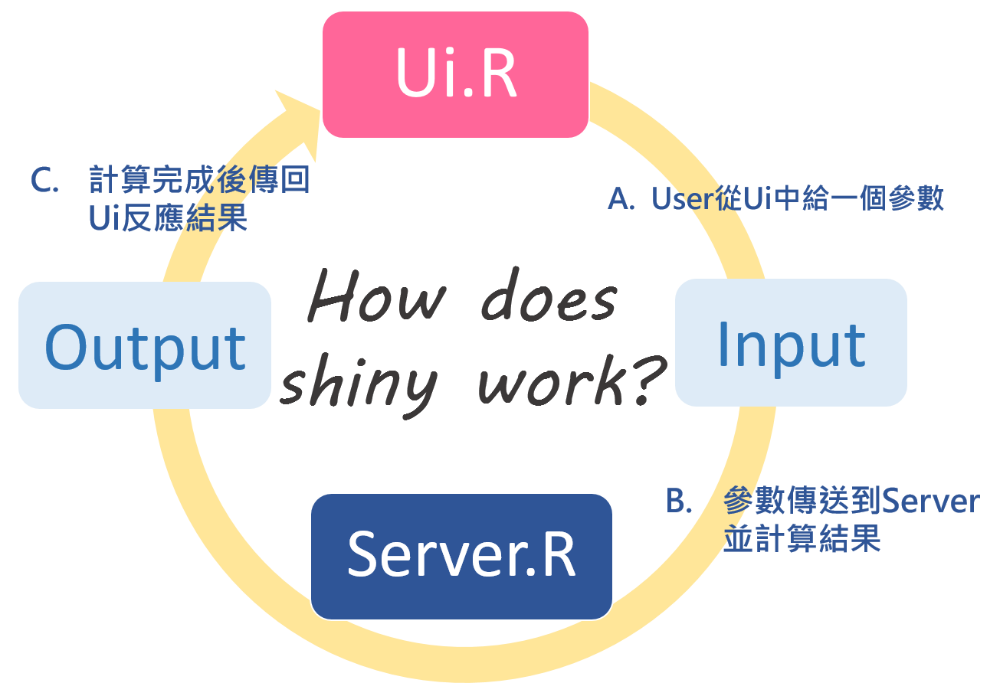
</div>

## [3.1] ui.R

```{r, comment='', echo=TRUE, eval=FALSE}
sidebarLayout(
  sidebarPanel('PUT WIDGETS DESIGN CODE HERE', width = 4), 
              # the defaulted width of sidebarPanel is 4-columns
  mainPanel('PUT OUTPUTS DESIGN CODE HERE', width = 8)
              # the defaulted width of sidebarPanel is 8-columns
)
```

<div class="text-center">
  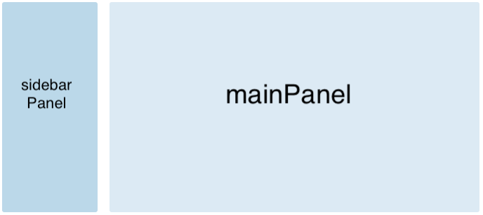
</div>

## [3.1] server.R

```{r, comment='', echo=TRUE, eval=FALSE}
# WRITE SOME FUNCTIONS, CODES FOR DATA COSTRUCTION AND TRANSFORMATION FIRST

output$OUTPUT_COMPONENT_NAME_1 <- DT::renderDataTable({
  # WHAT server SHOULD DO IN THIS COMPONENT TO PRESENT THE TABLE
})

output$UTPUT_COMPONENT_NAME_2 <- renderPlot({
  # WHAT server SHOULD DO IN THIS COMPONENT TO PRESENT THE PLOT
})

# ...
```

More details of output setting: https://shiny.rstudio.com/articles/output-args.html

## [3.1] Put ui and server together (1/2)

- ui and server can also be put together, like this:

```{r, comment='', echo=TRUE, eval=FALSE}
library(shiny)

ui <- fluidPage(
  sidebarLayout(
    sidebarPanel('PUT WIDGETS DESIGN CODE HERE', width = 4), 
    mainPanel('PUT OUTPUTS DESIGN CODE HERE', width = 4)
  ), 
  ...
)

server <- function(input, output) {
  # WRITE SOME FUNCTIONS, CODES FOR DATA COSTRUCTION AND TRANSFORMATION FIRST
  output$OUTPUT_COMPONENT_NAME_1 <- DT::renderDataTable({
    # WHAT server SHOULD DO IN THIS COMPONENT TO PRESENT THE TABLE
  })
  output$UTPUT_COMPONENT_NAME_2 <- renderPlot({
    # WHAT server SHOULD DO IN THIS COMPONENT TO PRESENT THE PLOT
  })
  ...
}

shinyApp(ui = ui, server = server)
```

## [3.1] Put ui and server together (2/2) {.smaller}

- Or put in the R markdown, like this slides.
  - When running an interactive document, `rmarkdown` extracts the code in code chunks and places them into a **pseudo `server.R`** file. R Markdown uses the html output of the `.RMD` as an `index.html` to place the reactive elements into.
  - Outputs in one code chunk can use widgets and reactive expressions that occur in other code chunks.
  - R Markdown doc. provides a layout for the app -> `ui.R` is not necessary.

<div class="text-center">
  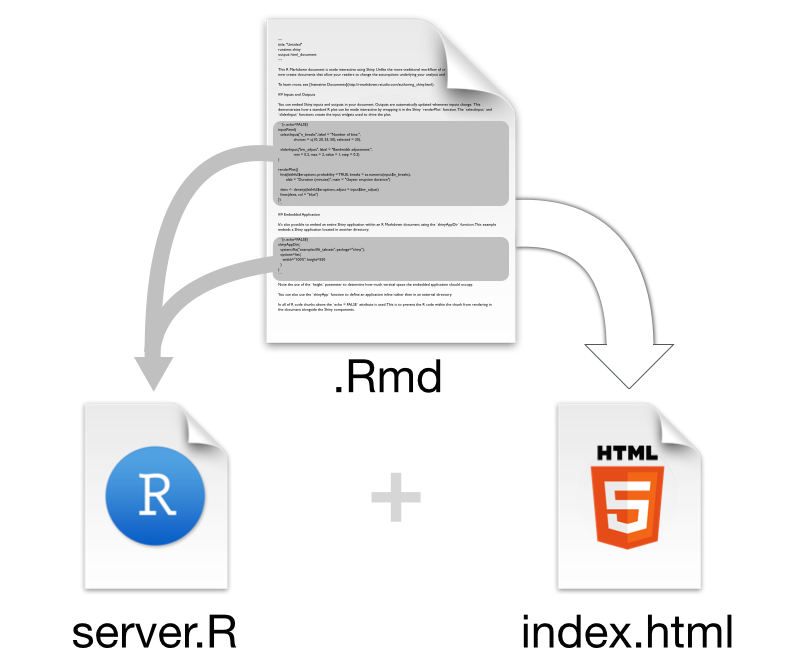
</div>

More details: https://shiny.rstudio.com/articles/interactive-docs.html

## [3.2] Panel / Widget design in Shiny

- Panel setting (Layout)
  - **`sidebarPanel`** and **`mainPanel`**
  - Tabset panel
  
- Input formats (Widgets): `selectInput`, `checkboxGroupInput`, `numericInput`, `sliderInput`, ...

- Output formats: `plotOutput`, `tableOutput`, `DT::dataTableOutput`, `leaflet::leafletOutput`, ...

- Examples:
  - `selectInput`: R color template & Pie chart
  - `checkboxGroupInput`: Map: Venues recommendation
  - `numericInput` and `sliderInput`
    - Binomial distribution & longest run of coin head/tail
    - Central Limit Theorem (CLT)

## [3.2.1] Panel setting (Layout)

There are 12 columns (4 in `sidebarPanel` and 8 in `mainPanel`) which can be flexibly subdivided into rows and columns. 

<div class="text-center">
  
</div>

Offical articles for basic part / layour of Shiny:

- https://shiny.rstudio.com/articles/basics.html
- https://shiny.rstudio.com/reference/shiny/0.14/sidebarLayout.html

## [3.2.1] Tabset Panel

Often applications need to subdivide their user-interface into discrete sections. This can be accomplished using the `tabsetPanel()` function.

<div class="text-center">
  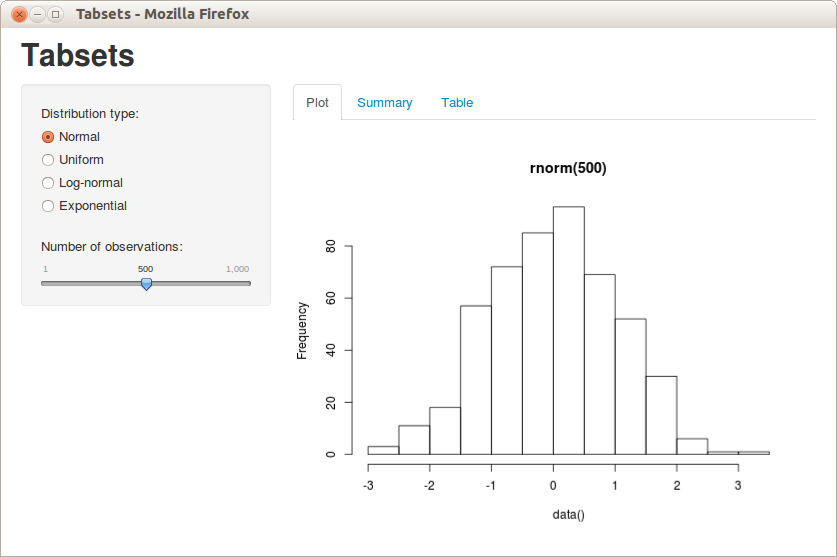
</div>

More details about layout: https://shiny.rstudio.com/articles/layout-guide.html

## Binomial distribution & longest run of coin head/tail (app) {.smaller}

```{r, comment='', echo=FALSE, message=FALSE, warning=FALSE}
## ui

sidebarLayout(
  sidebarPanel(sliderInput("prob_322", "The probability that 'head' appears",
                           min = 0, max = 1, value = 0.5),
               numericInput("n_322", "The sample size",
                            min = 100, max = 5000, value = 100, step = 100),
               width = 3),
  mainPanel(
    tabsetPanel(position = "above",
                tabPanel('Table', DT::dataTableOutput("tb_longest_streak")), 
                tabPanel('Plot', plotOutput('plt_longest_streak')))
  )
)

## server
coin <- function(p, n) {ifelse(runif(n) < p, 'H', 'T')}

output$tb_longest_streak <- DT::renderDataTable({
  p <- input$prob_322; n <- input$n_322
  x <- coin(p = p, n = n)
  matrix(x, ncol = 10)
})

output$plt_longest_streak <- renderPlot({
  p <- input$prob_322; n <- input$n_322
  df <- sapply(seq(0, 1, by = .01),
               function(pi) c(pi, max(rle(coin(p = pi, n = n))[[1]]))) %>% t() %>% as.data.frame()
  plot(df$V1, df$V2, type='l', xlab = 'Probability', ylab = 'The longest streak')
  text(.5, n*.9, paste0('Sample size = ', n))
})
```

## Binomial distribution & longest run of coin head/tail (ui code) {.smaller}

```{r, comment='', echo=TRUE, eval=FALSE, message=FALSE, warning=FALSE}
sidebarLayout(
  sidebarPanel(sliderInput("prob_322", "The probability that 'head' appears",
                           min = 0, max = 1, value = 0.5),
               numericInput("n_322", "The sample size",
                            min = 100, max = 5000, value = 100, step = 100), width = 3),
  mainPanel(
    tabsetPanel(position = "above",
                tabPanel('Table', DT::dataTableOutput("tb_longest_streak")), 
                tabPanel('Plot', plotOutput('plt_longest_streak'))))
)
```

## Binomial distribution & longest run of coin head/tail (server code) {.smaller}

```{r, comment='', echo=TRUE, eval=FALSE, message=FALSE, warning=FALSE}
coin <- function(p, n) {ifelse(runif(n) < p, 'H', 'T')}

output$tb_longest_streak <- DT::renderDataTable({
  p <- input$prob_32; n <- input$n_32; x <- coin(p = p, n = n)
  matrix(x, ncol = 10)
})

output$plt_longest_streak <- renderPlot({
  p <- input$prob_32; n <- input$n_32
  df <- sapply(seq(0, 1, by = .01),
               function(pi) c(pi, max(rle(coin(p = pi, n = n))[[1]]))) %>% t() %>% as.data.frame()
  plot(df$V1, df$V2, type='l', xlab = 'Probability', ylab = 'The longest streak')
  text(.5, n*.9, paste0('Sample size = ', n))
})
```

## [3.2.2] Input formats (Widgets)

<div class="text-center">
  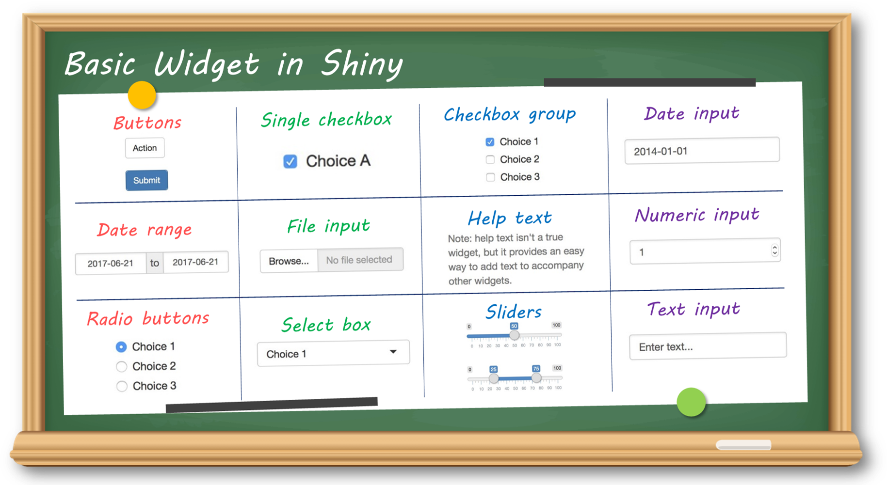
</div>

## [3.2.2] Input formats (Widgets)

<div class="text-center">
  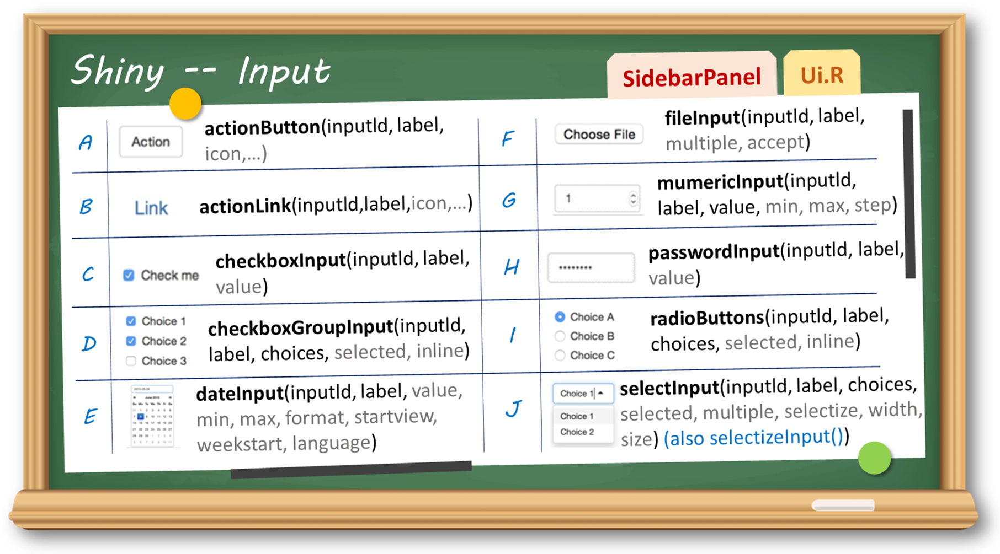
</div>

## [3.2.2] Widgets - selectInput

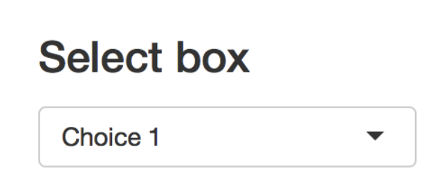

- Categorical variable

## R color template & Pie chart (ui code) {.smaller}

### Put our `selectInput` widget in the `sidebarPanel`

- Set `choices`
- The defalted value can be set with `selected` argument.

```{r, comment='', echo=TRUE, eval=FALSE}
sidebarLayout(
  sidebarPanel(selectInput("color_31", "The color template",
                           choices = c('Greys', 'Reds', 'Blues', 'Greens','rainbow'),
                           selected = 'Reds'),
               numericInput("n_31", "The number of colors: ",
                            min = 2, max = 9, value = 5, step = 1)),
  mainPanel(plotOutput("pie_color"))
)
```

## R color template & Pie chart (server code) {.smaller}

```{r, comment='', message=FALSE, warning=FALSE, echo=TRUE}
library(RColorBrewer)
```

```{r, comment='', echo=TRUE, eval=FALSE}
output$pie_color <- renderPlot({
  if (input$color_31 == 'rainbow') {
    colors <- rainbow(input$n_31)
  } else {
    colors <- brewer.pal(input$n_31, input$color_31)
  }
  par(mar = c(0, 0, 0, 0))  # close the inner margins
  par(oma = c(0, 0, 0, 0))  # close the outer margins
  pie(table(1:input$n_31), col = colors)
})
```

## R color template & Pie chart (app) {.smaller}

```{r, comment='', echo=FALSE}
sidebarLayout(
  sidebarPanel(selectInput("color_31", "The color template",
                           choices = c('Greys', 'Reds', 'Blues', 'Greens','rainbow'),
                           selected = 'Reds'),
               numericInput("n_31", "The number of colors: ",
                            min = 2, max = 9, value = 5, step = 1)),
  mainPanel(plotOutput("pie_color"))
)

output$pie_color <- renderPlot({
  if (input$color_31 == 'rainbow') {
    colors <- rainbow(input$n_31)
  } else {
    colors <- brewer.pal(input$n_31, input$color_31)
  }
  par(mar = c(0, 0, 0, 0))  # close the inner margins
  par(oma = c(0, 0, 0, 0))  # close the outer margins
  pie(table(1:input$n_31), col = colors)
})
```

## [3.2.2] Widgets - checkboxGroupInput

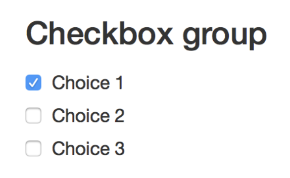

- Categorical variable
- Use as layers

## Map: Venues recommendation (app)

```{r, comment='', echo=FALSE}
library(leaflet)

sidebarLayout(
  sidebarPanel(
    checkboxGroupInput('playTN1', 'Want to play in TN?',
                       choices = c('Museum', 'Historic_site', 'Outdoor'), selected = 'Museum'),
    checkboxGroupInput('drinkTN1', 'Want to drink in TN?',
                       choices = c('Cafe', 'Bar'), selected = 'Bar'),
    checkboxGroupInput('eatTN1', 'Want to eat in TN?',
                       choices = c('Brunch', 'Dinner', 'Night_market'), selected = c('Dinner', 'Night_market')),
    checkboxGroupInput('hospTN1', 'Eat too much, have a toothache or stomachache?',
                       choices = c('Dentist', 'Internal_medcine')),
  ),
  mainPanel(leafletOutput("map_venues1"))
)

venues <- list(Cafe = list(lat = c(22.996545, 22.982398, 22.994841, 22.998205),
                          lng = c(120.216966, 120.193082, 120.217972, 120.201133),
                          loc =  c('MASA LOFT', '午營咖啡 a break cafe', 'Louisa Coffee (成大勝利店)', 'kokoni café'),
                          icon = './icons/Cafe.png'),
            Brunch = list(lat = c(22.994070, 22.991456, 22.984290, 22.999108),
                          lng = c(120.221047, 120.222033, 120.215221, 120.199255),
                          loc = c('濰克早午餐台南成大店', '綠木咖啡早午餐 Green Wood', '鹿耳晚晚早餐', '小北家灶咖'),
                          icon = './icons/Brunch.png'),
            Dinner = list(lat = c(22.991668, 22.994099, 22.982516),
                          lng = c(120.191856, 120.203678, 120.204432),
                          loc = c('沙卡里巴', '阿霞飯店', '有你真好 湘菜沙龍'),
                          icon = './icons/Dinner.png'),
            Bar = list(lat = c(22.994679, 22.993608, 22.988610),
                       lng = c(120.195527, 120.225973, 120.197088),
                       loc = c('Bar - Wanderer', '在島之後After Island. 餐酒館', 'Bar B&B - Bitters&Barrel'),
                       icon = './icons/Bar.png'),
            Dentist = list(lat = c(23.009835, 22.995844, 23.003242, 22.995558),
                           lng = c(120.224442, 120.200050, 120.202102, 120.228144),
                           loc = c('開慈牙醫診所', '宏恩牙醫診所', '小豆芽牙醫診所', '日初牙醫診所'),
                           icon = './icons/Dentist.png'),
            Internal_medcine = list(lat = c(22.992294, 22.994481, 22.999606, 22.994235),
                                    lng = c(120.226745, 120.210395, 120.234504, 120.228269),
                                    loc = c('高榮志家庭醫學科診所', '周田川診所', '健康超人兒科診所', '高愛文內科診所'),
                                    icon = './icons/Internal_Medicine.png'),
            Night_market = list(lat = c(22.982628, 23.003495, 23.011437),
                                lng = c(120.219342, 120.190521, 120.200348),
                                loc = c('大東夜市', '武聖夜市', '花園夜市 Garden Night Market'),
                                icon = './icons/Night_market.png'),
            Museum = list(lat = c(22.934660, 22.991103, 22.992028),
                          lng = c(120.226038, 120.205078, 120.204496),
                          loc = c('奇美博物館', '台南美術館', '台灣文學館'),
                          icon = './icons/Museum.png'),
            Outdoor = list(lat = c(23.003552, 23.154274, 23.000586),
                                 lng = c(120.159811, 120.100600, 120.216160),
                                 loc = c('安平樹屋', '七股鹽山', '成大榕園'),
                                 icon = './icons/Outdoor.png'),
            Historic_site = list(lat = c(22.997492, 23.001746, 22.989997),
                                 lng = c(120.202543, 120.160592, 120.204490),
                                 loc = c('赤崁樓', '安平古堡', '台南孔廟'),
                                 icon = './icons/Historic_Sites.png'))

output$map_venues1 <- renderLeaflet({
  display_classes <- c(input$playTN1, input$drinkTN1, input$eatTN1, input$hospTN1)
  m <- leaflet() %>% addTiles()
  for (claSS in names(venues)) {
    if (claSS %in% display_classes) {
      d <- venues[[claSS]]
      m <- m %>% addMarkers(lat = d$lat, lng = d$lng, popup = d$loc,
                            icon = icons(iconUrl = d$icon, iconWidth = 30, iconHeight = 30))
    }
  }
  m
})
```

## Map: Venues recommendation (ui code)

```{r, comment='', echo=TRUE, eval=FALSE}
sidebarLayout(
  sidebarPanel(
    checkboxGroupInput('playTN', 'Want to play in TN?',
                       choices = c('Museum', 'Historic_site', 'Outdoor'), selected = 'Museum'),
    checkboxGroupInput('drinkTN', 'Want to drink in TN?',
                       choices = c('Cafe', 'Bar'), selected = 'Bar'),
    checkboxGroupInput('eatTN', 'Want to eat in TN?',
                       choices = c('Brunch', 'Dinner', 'Night_market'), selected = c('Dinner', 'Night_market')),
    checkboxGroupInput('hospTN', 'Eat too much, have a toothache or stomachache?',
                       choices = c('Dentist', 'Internal_medcine')),
  ),
  mainPanel(leafletOutput("map_venues"))
)
```

## Map: Venues recommendation (server code)

```{r, comment='', echo=TRUE, eval=FALSE}
library(leaflet)

output$map_venues <- renderLeaflet({
  display_classes <- c(input$playTN, input$drinkTN, input$eatTN, input$hospTN)
  m <- leaflet() %>% addTiles()
  for (claSS in names(venues)) {
    if (claSS %in% display_classes) {
      d <- venues[[claSS]]
      m <- m %>% addMarkers(lat = d$lat, lng = d$lng, popup = d$loc,
                            icon = icons(iconUrl = d$icon, iconWidth = 30, iconHeight = 30))
    }
  }
  m
})
```

- More details about `leaflet` in `R Shiny`: https://rstudio.github.io/leaflet/shiny.html

## [3.2.2] Widgets - Date {.smaller}

```{r, comment='', echo=FALSE}
knitr::include_graphics(c("./photos/date.png", "./photos/date_range.png"))
```

- Date selection
- Date range selection

## Dates & Times exercise: Compute the duration (app)

Find out the number of days you have spent at NCKU as a registered student or staff person.

```{r, comment='', echo=FALSE}
sidebarLayout(
  sidebarPanel(
    dateRangeInput(inputId = 'dateR', label = 'Select dates range you spent at NCKU',
                  start = '2020-01-01', end = Sys.Date(),
                  min = '1990-01-01', max = Sys.Date(), format = "yyyy-mm-dd"), width = 5
  ), mainPanel(textOutput('textDays'), width = 5)
)

output$textDays <- renderText({
  paste0('You have spent ', input$dateR[2] - input$dateR[1],
         ' days at NCKU as a registered student or staff person.')
})
```

## Dates & Times exercise: Compute the duration (code)

```{r, comment='', echo=TRUE, eval=FALSE}
sidebarLayout(
  sidebarPanel(
    dateRangeInput(inputId = 'dateR', label = 'Select dates range you spent at NCKU',
                  start = '2020-01-01', end = Sys.Date(),
                  min = '1990-01-01', max = Sys.Date(), format = "yyyy-mm-dd"), width = 6
  ), mainPanel(textOutput('textDays'))
)

output$textDays <- renderText({
  paste0('You have spent ', input$dateR[2] - input$dateR[1],
         'days at NCKU as a registered student or staff person')
})
```

## Date widgets can be customized - Calendar App

- Roy Francis (2019): https://nbisweden.github.io/RaukR-2019/shiny/lab/shiny_lab.html#11_calendar_app

```{r, comment='', echo=FALSE}
cols <- toupper(c(
  "#bebada","#fb8072","#80b1d3","#fdb462","#b3de69","#fccde5","#FDBF6F","#A6CEE3",
  "#56B4E9","#B2DF8A","#FB9A99","#CAB2D6","#A9C4E2","#79C360","#FDB762","#9471B4",
  "#A4A4A4","#fbb4ae","#b3cde3","#ccebc5","#decbe4","#fed9a6","#ffffcc","#e5d8bd",
  "#fddaec","#f2f2f2","#8dd3c7","#d9d9d9"))

shinyApp(
  ui=fluidPage(
    pageWithSidebar(
      headerPanel(title="Calendar Planner",windowTitle="Calendar Planner"),
      sidebarPanel(
        h3("Duration"),
        fluidRow(
          column(6,style=list("padding-right: 5px;"),
                 dateInput("in_duration_date_start","From",value=format(Sys.time(),"%Y-%m-%d"))
          ),
          column(6,style=list("padding-left: 5px;"),
                 dateInput("in_duration_date_end","To",value=format(as.Date(Sys.time())+30,"%Y-%m-%d"))
          )
        ),
        h3("Tracks"),
        fluidRow(
          column(3,style=list("padding-right: 3px;"),
                 textInput("in_track_name_1",label="Name",value="Vacation",placeholder="Vacation")
          ),
          column(3,style=list("padding-right: 3px; padding-left: 3px;"),
                 dateInput("in_track_date_start_1",label="From",value=format(Sys.time(),"%Y-%m-%d"))
          ),
          column(3,style=list("padding-right: 3px; padding-left: 3px;"),
                 dateInput("in_track_date_end_1",label="To",value=format(as.Date(Sys.time())+30,"%Y-%m-%d"))
          ),
          column(3,style=list("padding-left: 3px;"),
                 colourpicker::colourInput("in_track_colour_1",label="Colour",
                                           palette="limited",allowedCols=cols,value=cols[1])
          )
        ),
        fluidRow(
          column(3,style=list("padding-right: 3px;"),
                 textInput("in_track_name_2",label="Name",value="Offline",placeholder="Offline")
          ),
          column(3,style=list("padding-right: 3px; padding-left: 3px;"),
                 dateInput("in_track_date_start_2",label="From",value=format(Sys.time(),"%Y-%m-%d"))
          ),
          column(3,style=list("padding-right: 3px; padding-left: 3px;"),
                 dateInput("in_track_date_end_2",label="To",value=format(as.Date(Sys.time())+30,"%Y-%m-%d"))
          ),
          column(3,style=list("padding-left: 3px;"),
                 colourpicker::colourInput("in_track_colour_2",label="Colour",
                                           palette="limited",allowedCols=cols,value=cols[2])
          )
        ),
        fluidRow(
          column(6,style=list("padding-right: 5px;"),
                 colourpicker::colourInput("in_track_colour_available",label="Track colour (Available)",
                                           palette="limited",allowedCols=cols,value=cols[length(cols)-1])
          ),
          column(6,style=list("padding-left: 5px;"),
                 colourpicker::colourInput("in_track_colour_weekend",label="Track colour (Weekend)",
                                           palette="limited",allowedCols=cols,value=cols[length(cols)])
          )
        ),
        tags$br(),
        h3("Settings"),
        selectInput("in_legend_position",label="Legend position",
                    choices=c("top","right","left","bottom"),selected="right",multiple=F),
        fluidRow(
          column(6,style=list("padding-right: 5px;"),
                 selectInput("in_legend_justification",label="Legend justification",
                             choices=c("left","right"),selected="right",multiple=F)
          ),
          column(6,style=list("padding-left: 5px;"),
                 selectInput("in_legend_direction",label="Legend direction",
                             choices=c("vertical","horizontal"),selected="vertical",multiple=F)
          )
        ),
        fluidRow(
          column(6,style=list("padding-right: 5px;"),
                 numericInput("in_themefontsize",label="Theme font size",value=8,step=0.5)
          ),
          column(6,style=list("padding-left: 5px;"),
                 numericInput("in_datefontsize",label="Date font size",value=2.5,step=0.1)
          )
        ),
        fluidRow(
          column(6,style=list("padding-right: 5px;"),
                 numericInput("in_monthfontsize",label="Month font size",value=8,step=0.5)
          ),
          column(6,style=list("padding-left: 5px;"),
                 numericInput("in_legendfontsize",label="Legend font size",value=5,step=0.5)
          )
        ),
        tags$br(),
        h3("Download"),
        helpText("Width is automatically calculated based on the number of weeks. File type is only applicable to download and does not change preview."),
        fluidRow(
          column(6,style=list("padding-right: 5px;"),
                 numericInput("in_height","Height (cm)",step=0.5,value=5.5)
          ),
          column(6,style=list("padding-left: 5px;"),
                 numericInput("in_width","Width (cm)",step=0.5,value=NA)
          )
        ),
        fluidRow(
          column(6,style=list("padding-right: 5px;"),
                 selectInput("in_res","Res/DPI",choices=c("200","300","400","500"),selected="200")
          ),
          column(6,style=list("padding-left: 5px;"),
                 selectInput("in_format","File type",choices=c("png","tiff","jpeg","pdf"),selected="png",multiple=FALSE,selectize=TRUE)
          )
        ),
        downloadButton("btn_downloadplot","Download Plot"),
        tags$hr(),
        helpText("2019 | RaukR")
      ),
      mainPanel(
        sliderInput("in_scale","Image preview scale",min=0.1,max=3,step=0.10,value=1),
        helpText("Scale only controls preview here and does not affect download."),
        tags$br(),
        imageOutput("out_plot")
      )
    )
  ),
  server=function(input,output){}
)
```

## [3.2.2] Widgets - sliderInput and numericInput

```{r, comment='', echo=FALSE}
knitr::include_graphics(c("./photos/slider.png", "./photos/numeric.png"))
```

- Numeric varibale
- Defaulted value can be set in both widgets.
- `step` can be set in `numericInput`

## Central Limit Theorem (CLT) (app) {.smaller}

```{r, comment='', echo=FALSE, message=FALSE, warning=FALSE}
sidebarLayout(
  sidebarPanel(
    tags$style(type = 'text/css',
               ".selectize-input { font-size: 18px; line-height: 18px;} .selectize-dropdown { font-size: 20px; line-height: 20px; }"),
    selectInput("distri_332", "The population distribution",
                choices = c('Exponential', 'Normal', 'Poisson'), selected = 'Poisson'),
    sliderInput('b_332', 'The bound of x-axis', min = 3, max = 10, value = 3),
    numericInput("lambda_332", "lambda",
                 min = 0, max = 50, value = 5, step = 1),
    numericInput("pop_n_332", "Population size",
                 min = 1000, max = 100000, value = 10000, step = 1000),
    numericInput("ss_n_332", "Sample size",
                 min = 2, max = 50, value = 5, step = 1),
    numericInput("nIter_332", "The number of sampling iterations",
                 min = 100, max = 10000, value = 1000, step = 100)),
  mainPanel(
    tabsetPanel(position = "above",
                tabPanel('Population Distribution', plotOutput('disPlot_pop')), 
                tabPanel('Sampling Distribution', plotOutput('disPlot_sp')))
  )
)

output$disPlot_pop <- renderPlot({
  qplot(f_distri(n = input$pop_n_332, distri = input$distri_332, lambda = input$lambda_332),
        geom = c('density', 'bar')[(input$pop_n_332 == 'Poisson') + 1],
        xlab = '', xlim = c(-input$b_332, input$b_332),
        main = paste0('The Density Plot of ', input$distri_332, ' Distribution')) +
    theme_bw()
})
    
output$disPlot_sp <- renderPlot({
  x <- sapply(1:input$nIter_332,
              function(i) mean(f_distri(
                n = input$ss_n_332, distri = input$distri_332, lambda = input$lambda_332)))
  qplot(x, geom = 'density',
        xlab = '', xlim = c(-input$b_332, input$b_332),
          main = 'The Density Plot of Sampling Distribution') + theme_bw()
})
```

## CLT (ui code) {.smaller}

- Widgets:
  -selectInput, sliderInput, and numericInput

- Tabset Panel

```{r, comment='', echo=TRUE, eval=FALSE}
sidebarLayout(
  sidebarPanel(
    tags$style(type = 'text/css',
               ".selectize-input { font-size: 18px; line-height: 18px;} .selectize-dropdown { font-size: 20px; line-height: 20px; }"),
    selectInput("distri_332", "The population distribution",
                choices = c('Exponential', 'Normal', 'Poisson'), selected = 'Poisson'),
    sliderInput('b_332', 'The bound of x-axis', min = 3, max = 10, value = 3),
    numericInput("lambda_332", "lambda",
                 min = 0, max = 50, value = 5, step = 1),
    numericInput("pop_n_332", "Population size",
                 min = 1000, max = 100000, value = 10000, step = 1000),
    numericInput("ss_n_332", "Sample size",
                 min = 2, max = 50, value = 5, step = 1),
    numericInput("nIter_332", "The number of sampling iterations",
                 min = 100, max = 10000, value = 1000, step = 100)),
  mainPanel(
    tabsetPanel(position = "above",
                tabPanel('Population Distribution', plotOutput('disPlot_pop')), 
                tabPanel('Sampling Distribution', plotOutput('disPlot_sp')))
  )
)
```

## CLT (server code 1/2) {.smaller}

### Write a function to generate the population distribution

```{r, comment='', echo=TRUE}
f_distri <- function(n, distri, lambda=NULL, sigmaa=NULL, df=NULL) {
  if (distri == 'Exponential') {x <- rexp(n = n, r = lambda)}
  else if (distri == 'Poisson') {x <- rpois(n = n, lambda = lambda)}
  else if (distri == 'Normal') {x <- rnorm(n = n, mean = lambda)}
  else if (distri == 't') {x <- rt(n = n, df = df)}
  return(x)
}
```

## CLT (server code 2/2) {.smaller}

### Code for how output components operate

```{r, comment='', echo=TRUE, eval=FALSE}
output$disPlot_pop <- renderPlot({
  qplot(f_distri(n = input$pop_n_332, distri = input$distri_332, lambda = input$lambda_332),
        geom = c('density', 'bar')[(input$pop_n_332 == 'Poisson') + 1],
        xlab = '', xlim = c(-input$b_332, input$b_332),
        main = paste0('The Density Plot of ', input$distri_332, ' Distribution')) +
    theme_bw()
})
    
output$disPlot_sp <- renderPlot({
  x <- sapply(1:input$nIter_332,
              function(i) mean(f_distri(
                n = input$ss_n_332, distri = input$distri_332, lambda = input$lambda_332)))
  qplot(x, geom = 'density',
        xlab = '', xlim = c(-input$b_332, input$b_332),
          main = 'The Density Plot of Sampling Distribution') + theme_bw()
})
```

## sliderInput can be customized

<div class="text-center">
  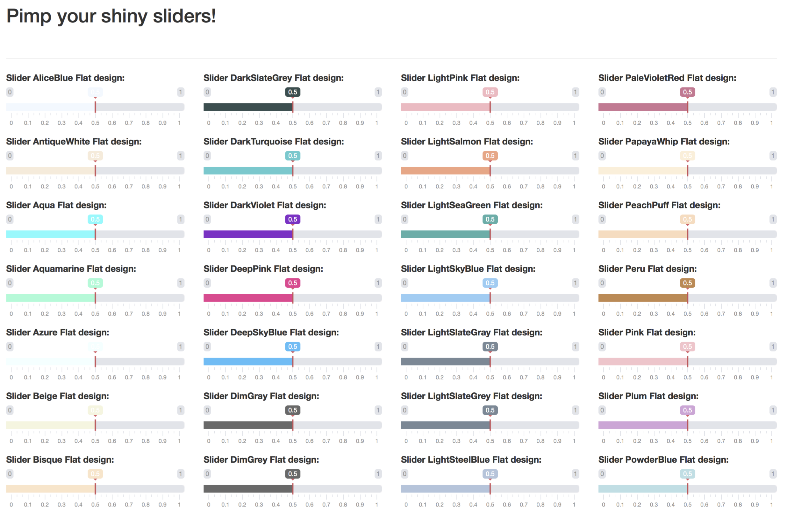
</div>

More details:
- https://shiny.rstudio.com/articles/sliders.html
- https://divadnojnarg.github.io/blog/customsliderinput/


## [4] More Shiny App Resources and Examples

- References of today's tutorial:
  - Doi, J., Potter, G., Wong, J., Alcaraz, I., & Chi, P. (2016). Web Application Teaching Tools for Statistics Using R and Shiny. Technology Innovations in Statistics Education, 9(1).
  - Fawcett, L. (2018). Using Interactive Shiny Applications to Facilitate Research-Informed Learning and Teaching. Journal of Statistics Education, 26(1), 2-16.
  - Sheu, Ching-Fan. Exercises of _Data Management_.

- Great examples for Statistics teaching using Shiny:
  - https://github.com/wenjietseng/shinyapps
  - https://github.com/jodeleeuw/shiny-stats
  
- Great tutorials for getting familiar with R Shiny:
  - https://shiny.rstudio.com/tutorial/written-tutorial/lesson1/ (Official)
  - https://bookdown.org/tpemartin/shiny_intro/shiny-part-i.html#ui- （中文）

- Shiny Gallery: https://shiny.rstudio.com/gallery/#user-showcase

- An excellant article talking about "Communication via data"
  - [如何溝通資料：互動式圖表及 R 語言（郭耀仁 Yao-Jen Kuo
）](https://medium.com/datainpoint/interactive-gapminder-with-r-ea4adeea2830)


## Summary

- Studies have suggested that web application teaching tools help statistics students learn material more effectively.

- Many of these applications have been implemented as Java/Javascript applets. Shiny is a technology that allows an instructor to create web application teaching tools.

- The construction of applets can require fluency in Java, Javascript, HTML, CSS, and PHP languages, but with Shiny all that is needed is some familiarity with R.

- There are a lot of Shiny App resources and examples on the internet.

<div class="notes">

This is my *note*.

- Using Shiny eliminates R interruptions due to script-changing and the console need not ever be shown.

</div>

## Take-Home Messages

#### 1. R Shiny web app is **easy and straightforward** for users.

<br/>

#### 2. Based on R language nature, R Shiny is **useful in demonstrating statistics / data analysis**.

<br/>

#### 3. R shiny is helpful in **interdisciplinary** communication and cooperation,

- especially in the scenario which **insight of data** should be clearly presented.

<br/>

#### 4. All you need to build your own R Shiny app: **ui & server** with R programming and/or markdown code.

- Other web programming language is not necessary. 

<br/>

### Try to use R Shiny for your next presentation!

<div class="notes">

1. The just-in-time interaction design of R Shiny web app is **easy and straightforward** for users.

2. Based on R language nature, R Shiny is **useful in demonstrating statistics / data analysis**.

3. R shiny is helpful in **interdisciplinary** communication and cooperation, especially in the scenario which **insight of data** should be clearly presented.

4. All you need to build your own R Shiny app: **ui & server** with R programming and/or markdown code. Other web programming language is not necessary. 

</div>

## Thanks you for your attenetion!

<br/>

### Any question or comment?

<br/>

<div class="text-center">
  
</div>

- <u> 廖傑恩 Jay Liao </u> | jay.chiehen[at]gmail.com | Department of Psychology
- <u> 蘇柏純 Teresa Su </u> | kyotoigo[at]gmail.com | Institute of Education

## Appendix

These are some components of basic tutorials of building an R shiny app from the reference paper (Doi et al., 2016). If you want to learn more, it is recommended to revise the .Rmd file of this slide by yourself!

<br/>

<div class="blue2">A. Shiny Basics</div>

<div class="blue2">
install.packages("shiny")
library(shiny)

runExample("01_hello")
</div>

Another entry point to Shiny is via R Markdown

## Appendix
<div class="blue2">A.2. Anatomy of a Shiny App</div>

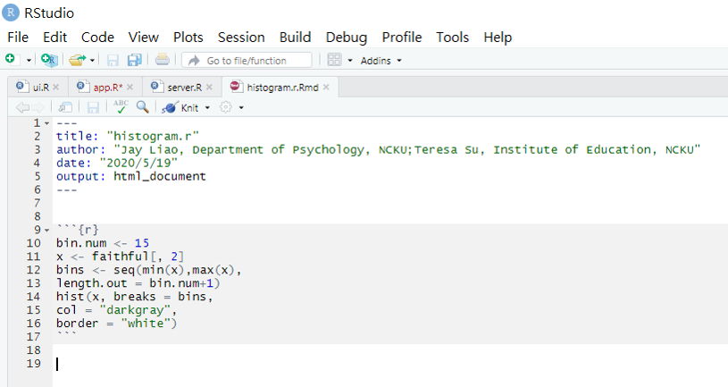 
 
## Appendix
<div class="blue2">A.2. Anatomy of a Shiny App</div>

 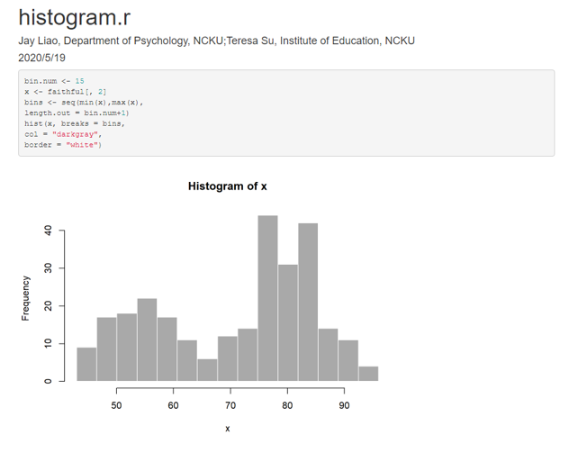

## Appendix

<div class="blue2">A.3. Reactive Programming</div>

<div class="red">reactive expressions</div>

what we desire is for the app to re-randomize only when the trials slider is updated or when the “Generate” button is clicked, but not when the run length slider is updated.

## Appendix
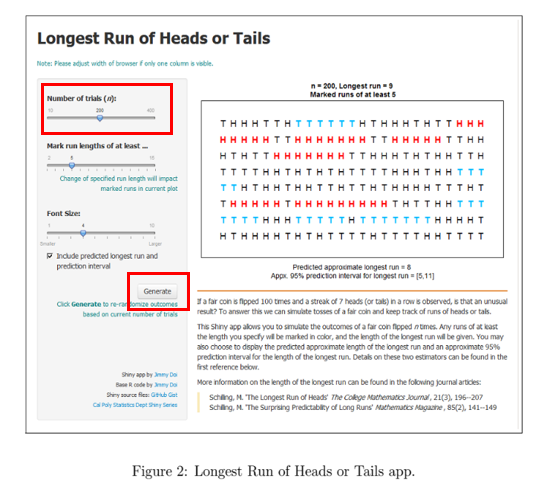

## Appendix

<div class="blue2">A.4. Launching a Shiny App</div>
keyboard shortcut Control+Shift+Enter
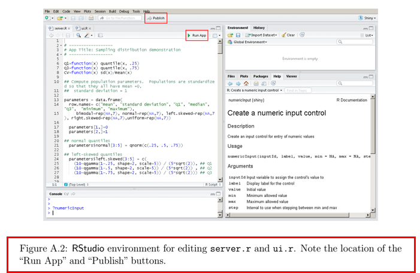

## Appendix
<div class="blue2">A.5. Deploying/Publishing a Shiny App</div>

library(shinyapps)
deployApp()

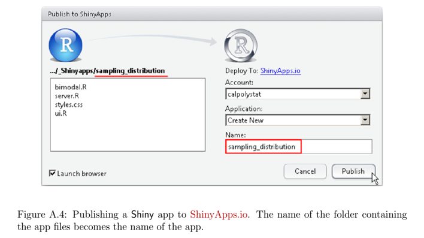